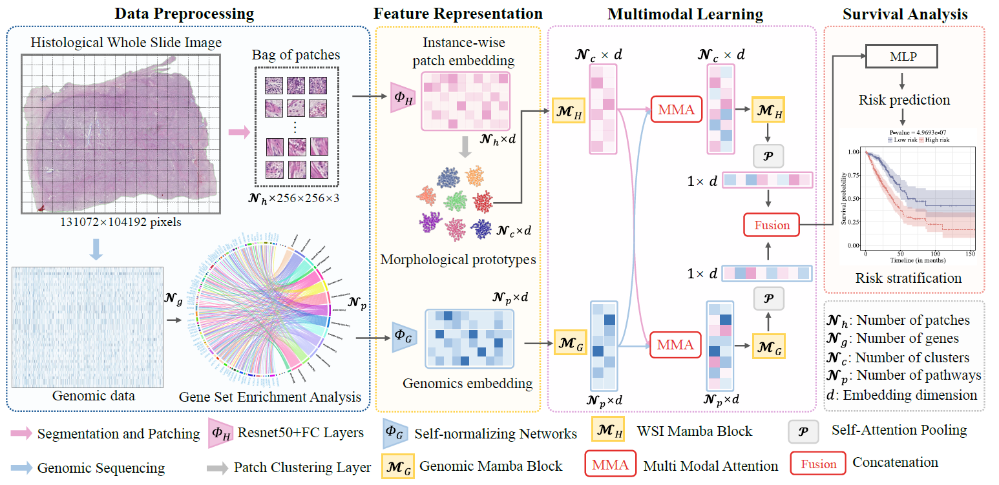

# SAMamba: Integrating State Space Model for Enhanced Multi-modal Survival Analysis

Thank you for your attention of our work. This is the codebase for Survival Analysis Mamba (SAMamba).


## SAMamba Pipeline




## Environment

``````
torch==2.1.2
torchvision==0.16.2
scikit-survival==0.22.2
mamba-ssm==1.2.0.post1
``````

We also provide a requirement.txt file for you to track the version of each package.

You could also build the environment from [CMAT](https://github.com/FT-ZHOU-ZZZ/CMTA/tree/main) and [MOTcat](https://github.com/Innse/MOTCat/tree/main), with two additional packages from [Mamba](https://github.com/state-spaces/mamba):

``````
pip install mamba-ssm
pip install mamba-ssm[causal-conv1d]
``````


## Data preparation

#### 1. The Whole Slide Image (WSI)

- Download

  The raw WSI can be downloaded from the website of [TCGA](https://portal.gdc.cancer.gov/), and the dir is as follows:

  ```
  DATA_DIRECTORY/
  	├── slide_1.svs
  	├── slide_2.svs
  	└── ...
  ```

- Preprocessing

  We follow the instruction of [CLAM](https://github.com/mahmoodlab/CLAM) to process the WSIs from TCGA.

  - Create patches

  ```
  python create_patches_fp.py --source DATA_DIRECTORY --save_dir RESULTS_DIRECTORY --patch_size 256 --seg --patch --stitch 
  ```

  After creating patches, you will obtain below folders:

  ```
  RESULTS_DIRECTORY/
  	├── masks
      		├── slide_1.png
      		├── slide_2.png
      		└── ...
  	├── patches
      		├── slide_1.h5
      		├── slide_2.h5
      		└── ...
  	├── stitches
      		├── slide_1.png
      		├── slide_2.png
      		└── ...
  	└── process_list_autogen.csv
  ```

  - Extract features

  ```
  CUDA_VISIBLE_DEVICES=0 python extract_features_fp.py --data_h5_dir RESULTS_DIRECTORY --data_slide_dir DATA_DIRECTORY --csv_path RESULTS_DIRECTORY/process_list_autogen.csv --feat_dir FEATURES_DIRECTORY --batch_size 512 --slide_ext .svs
  ```

  After the feature extraction, you will obtain the following folders:

  ```
  FEATURES_DIRECTORY/
      ├── h5_files
              ├── slide_1.h5
              ├── slide_2.h5
              └── ...
      └── pt_files
              ├── slide_1.pt
              ├── slide_2.pt
              └── ...
  ```

#### 2. Genomics data

We use the genomics data from [MCAT](https://github.com/mahmoodlab/MCAT). Our processed pathway data and genomics data in MCAT can be found at [CSV](./csv).


## Commands

The commands for all datasets are in [commands.md](./script/commands.md).

```
CUDA_VISIBLE_DEVICES=0 python main.py \
--dataset tcga_brca \ 
--data_root_dir FEATURES_DIRECTORY  \
--model brca_samamba \ 
--gene_dir PATHWAY_DIR \
--num_pathway 284 
```

`--dataset` is for the dataset name you use, `--data_root_dir` is for the dir of the processed  WSIs, `--model` is the name for the model you train of this command, `--gene_dir` is the directory of the processed gene signature, `--num_pathway` is the number of pathways in each dataset.


## Acknowledgement

Many thanks to [CLAM](https://github.com/mahmoodlab/CLAM), [MCAT](https://github.com/mahmoodlab/MCAT), [CMAT](https://github.com/FT-ZHOU-ZZZ/CMTA/tree/main), [MOTcat](https://github.com/Innse/MOTCat/tree/main) and [Mamba](https://github.com/state-spaces/mamba) for their opensource and the contributions to this community.


## Citation 

Please feel free to cite us if our work could be helpful for your study. Thank you.

```
@inproceedings{zhang2024samamba,
  title={SAMamba: Integrating State Space Model for Enhanced Multi-modal Survival Analysis},
  author={Zhang, Wei and Chen, Tong and Xu, Wenxin and Li, Xinyue},
  booktitle={2024 IEEE International Conference on Bioinformatics and Biomedicine (BIBM)},
  year={2024},
  pages={1334-1341},
  organization={IEEE}
}
```